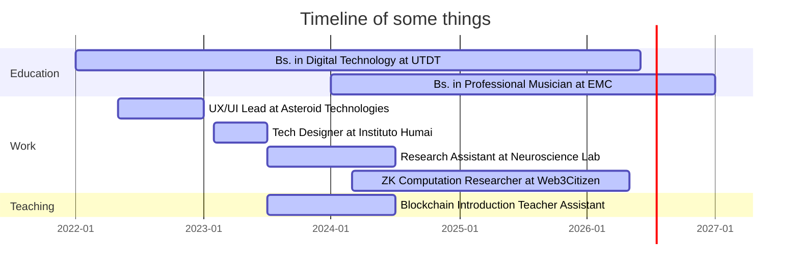

---
# the default layout is 'page'
icon: fas fa-info-circle
order: 4
mermaid: true
math: true
comments: true

---

# Hey! I'm Lu :)

Formally, research assistant in the neuroscience lab at Torcuato Di Tella University, investigating political polarization. Currently building Detoxigram, a project that aims to mitigate the impact of toxicity in text channels.

Informally, learning about Blockchain and Zero Knowledge. Right now I'm trying to get my mind around zk computation and the projects around that.

I'm interested in undestanding the intersection between computer science and human behaviour, eager to work at the edge of tech while building new governance systems (future goal) :)

Excited about blockchain, game theory, math, politics and human behivour.

## Protocols I'm into right now:
- Aztec
- RISC Zero
- Nexus
- Talent Protocol V2

## Technology I'm excited about:
- Zero Knowledge Proofs
- Zero Knowledge Computation
- Machine Learning 